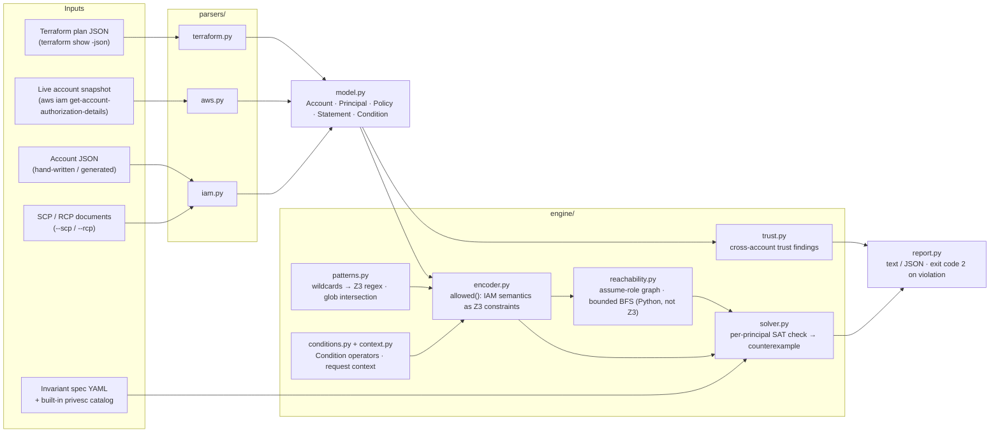

# Architecture

iamprover has a deliberately small pipeline: **ingest → model → encode → solve → report**.
Every input format converges on one in-memory model, and every feature is expressed as a
constraint over that model — there is exactly one place where IAM evaluation semantics live.



## The stages

### 1. Parsers (`parsers/`)

Three front-ends, one output type: `model.Account`.

- **`terraform.py`** — reads `terraform show -json plan` output: inline policies, managed
  policies (resolved by ARN or configuration reference), and `aws_s3_bucket_policy`
  resources.
- **`aws.py`** — reads a live-account snapshot from
  `aws iam get-account-authorization-details`: flattens group memberships and
  managed-policy attachments onto each principal, picks each policy's default version,
  URL-decodes policy documents, and resolves `PermissionsBoundaryArn` to the actual
  boundary policy.
- **`iam.py`** — reads a plain account-description JSON (principals + policies), and
  standalone policy documents for `--scp`/`--rcp`.

Parsers do *no* interpretation of what a policy means — they only normalize shape.
Anything semantic belongs in the encoder.

### 2. Model (`model.py`)

Plain dataclasses, no behavior: `Account` (principals, resource policies, SCPs, RCPs),
`Principal` (identity policies, optional trust policy, optional permission boundary),
`Policy`, `Statement`, `Condition`. This is the single interface between ingestion and
verification — a new input format only has to produce these.

### 3. Encoder (`engine/encoder.py`)

The heart of the tool. `allowed(principal, action, resource, ctx, ...)` returns **one Z3
boolean constraint** that is true exactly when AWS would authorize the request, for the
modeled fragment:

```
identity_path  = identity_allow  AND boundary_allow AND scp_allow
resource_path  = resource_allow  AND rcp_allow      AND scp_allow
allowed        = (identity_path OR resource_path) AND NOT (any explicit Deny in any layer)
```

Supporting modules:

- **`patterns.py`** — compiles IAM wildcard patterns (`*`, `?`) into Z3 regular
  expressions; widens policy variables (`${aws:username}`) to `*` in positive positions;
  also provides `globs_intersect`, a pure-Python glob-intersection check used to skip
  provably-unsatisfiable solver queries.
- **`conditions.py` / `context.py`** — encode `Condition` blocks over free request-context
  variables (the solver searches over all contexts; counterexamples report the assignment).
  Unknown operators degrade in the over-approximating direction: true on Allow, false on
  Deny.

### 4. Solver (`engine/solver.py`)

For each `(principal, invariant)` pair, asserts *“the forbidden request is allowed”* and
asks Z3 for a model:

- **UNSAT** → the invariant is *proved* for that principal (over all actions, resources,
  and contexts in the modeled fragment — not merely “no findings”).
- **SAT** → the model is read back as a concrete counterexample: action, resource, and the
  request context that makes it fire. Chain invariants (`forbid_chain`) encode each step as
  an independent request and report every step.

A cheap syntactic prefilter (`globs_intersect` over the principal's Allow statements) skips
the Z3 query entirely when no statement could possibly grant the forbidden action/resource
— sound, because bounding layers and conditions can only *restrict* further.

### 5. Reachability (`engine/reachability.py`)

`--closure assume-role` extends every invariant over transitive `sts:AssumeRole` chains.
This stage is **plain Python, deliberately not Z3**:

1. **Graph build** — an edge `P → Q` exists iff P's identity policies grant an assume-role
   action on Q (checked with the same `allowed()` encoder) *and* Q's trust policy names P.
   The graph is built trust-side-out: only principals a trust policy actually names are
   candidate sources, so cost scales with trust grants, not principal pairs.
2. **Bounded BFS** — shortest chains from each source, bounded by `--max-hops`
   (default 4), with parent-pointer chain reconstruction.
3. **Evaluation** — for a principal with no direct violation, reachable targets are checked
   nearest-first; the first violating target yields a counterexample whose steps are the
   assume-role hops followed by the target's violation.

Keeping graph construction, traversal, and proof evaluation separate means future closure
relations (e.g. `iam:PassRole` into service execution) slot in without touching the prover.

### 6. Trust analysis (`engine/trust.py`) and reporting (`report.py`)

`--check-trust` walks role trust policies for grants reaching outside the account, and
classifies them as guarded (ExternalId / org id / source account) or unguarded.
`report.py` renders text or JSON; any violation or unguarded trust grant exits with code 2
for CI gating.

## Soundness invariant (read this before contributing)

Everything in the engine preserves one direction of error: **permissions are only ever
over-approximated.** Unknown condition operators, policy variables, guarded trust edges —
every modeling gap must widen what a principal can do, never narrow it. iamprover may
report a violation that a real condition would prevent (false positive), but within the
modeled fragment it must never miss one (no false negatives). Trust the `PASS`es;
investigate the `FAIL`s.

If a change can suppress a true violation, it is wrong, no matter how much noise it removes.
